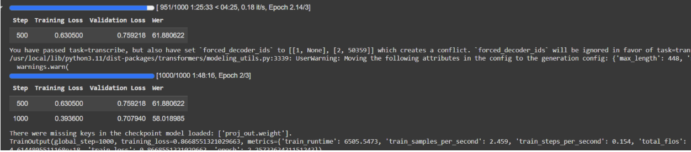
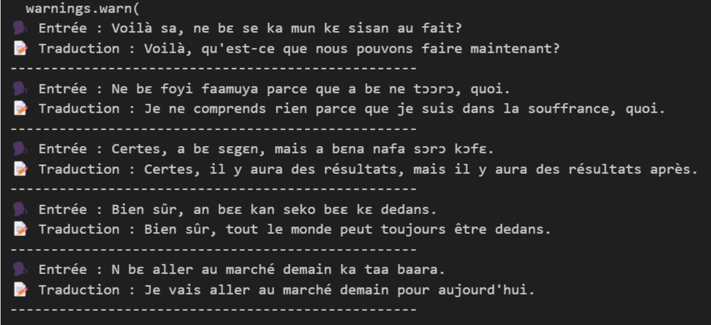
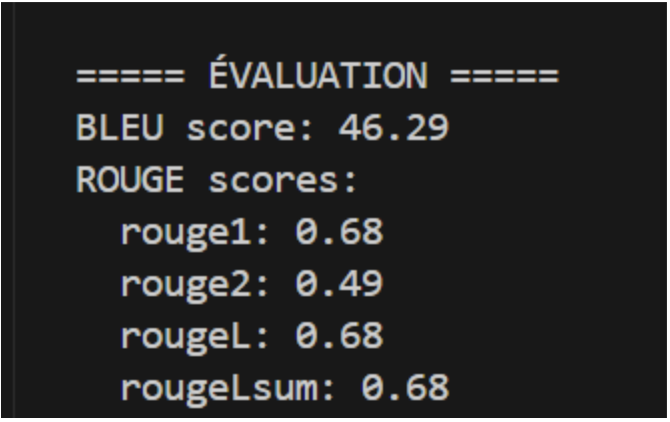
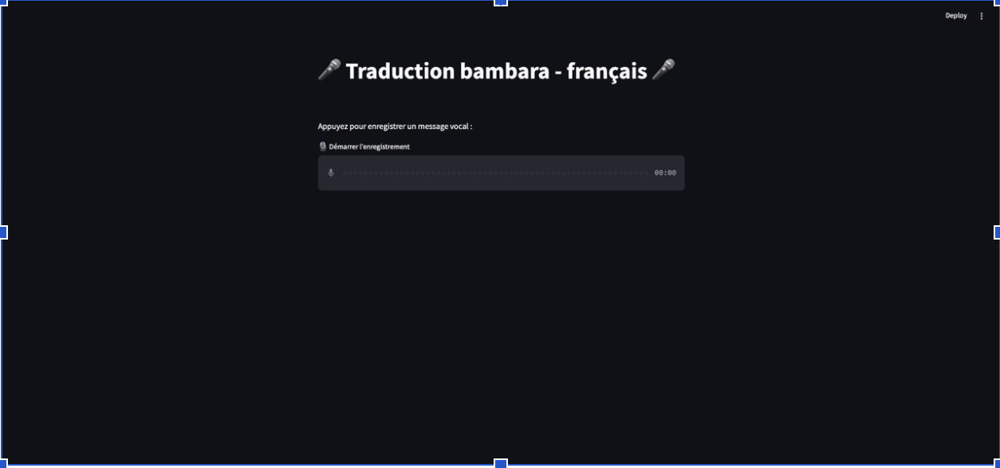
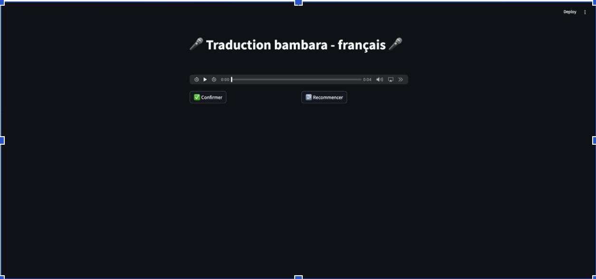
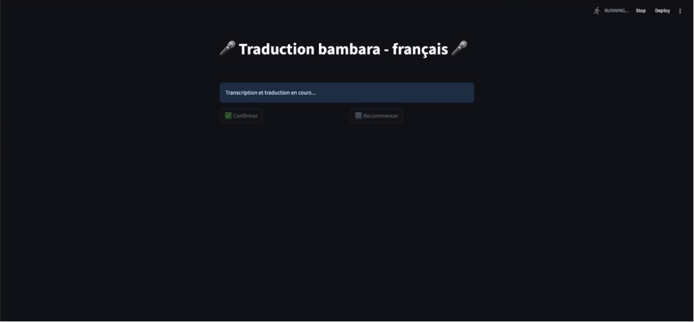
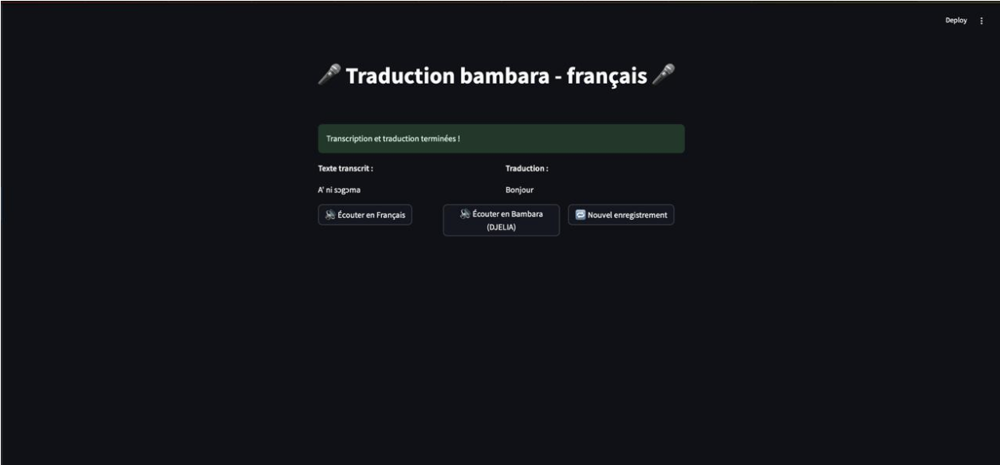

# Bambara Voice Bridge

Prototype IA de transcription et traduction vocale **Bambara -> Francais**, construit pour demontrer un pipeline complet : donnees, entrainement, evaluation et interface de test.

## Vision du projet

Ce projet adresse un besoin concret : rendre le contenu oral en Bambara plus accessible en francais, avec une approche orientee usage reel.

Il sert a la fois de :
- socle technique pour des cas d'usage terrain (education, media, services),
- preuve de faisabilite sur des langues sous-dotees,
- base de travail pour des iterations futures (qualite, robustesse, deploiement).

## Composants principaux

- **ASR (transcription)** : Whisper fine-tune sur donnees Bambara.
- **Traduction** : NLLB fine-tune et comparaison avec API externe.
- **Interface** : application Streamlit pour enregistrer un audio et comparer les sorties.
- **Evaluation** : mesures quantitatives (WER, BLEU, ROUGE-L) + captures d'execution.

## Resultats actuels

- `WER` transcription : **58** (amelioration depuis 61)
- `BLEU` traduction : **46.29**
- `ROUGE-L` traduction : **0.68**

Ces scores correspondent a un premier prototype fonctionnel. Les principaux leviers d'amelioration sont l'enrichissement des donnees, la normalisation linguistique et l'optimisation d'inference.

## Captures de validation

### 1) Resultat WER (transcription)


### 2) Test du modele de traduction


### 3) Score BLEU et ROUGE-L


### 4) Sortie interface graphique - exemple 1


### 5) Sortie interface graphique - exemple 2


### 6) Sortie interface graphique 


### 7) Sortie interface graphique - 


## Lancer le projet

### Prerequis

- Python 3.10+
- `pip install -r requirements.txt`
- Modeles locaux disponibles :
  - `modele_whisper_transcription/`
  - `modele_nllb_traduction/`

### Executer l'application principale

```bash
streamlit run streamlit.py
```

Option de demo simplifiee :

```bash
streamlit run app.py
```

## Lire et comprendre rapidement le repository

- `README_FICHIERS.md` : role de chaque script/fichier important.
- `notebooks/README.md` : guide des notebooks et de leur statut.
- `archive/README.md` : explication des notebooks archives (brut vs nettoye).

## Travail d'equipe

Ce prototype est un travail collaboratif a trois, avec des contributions sur la preparation des donnees, le fine-tuning et l'interface de demonstration.
